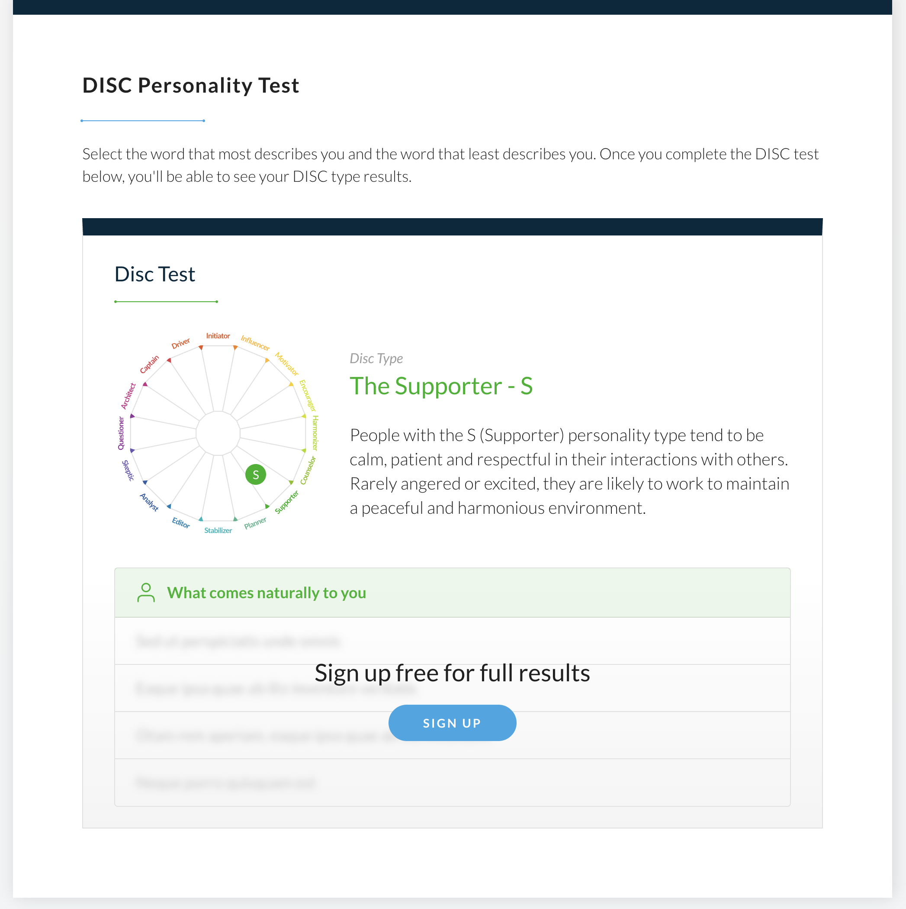

# Telgea MVNO Integration – REST Converter

This project implements a partial integration between a new MVNO partner's REST API and Telgea's internal normalized format. It focuses on converting REST API responses related to data usage into the expected internal structure.

## Architecture & Approach

The goal of this implementation is to demonstrate a clean, testable, and scalable approach to mapping external telecom data (in REST format) to Telgea's internal API schema. The conversion logic is kept isolated from the HTTP layer to allow unit testing and potential reuse in other interfaces (e.g. queues, workers, or batch jobs).

Key decisions:

- **Typed contracts** using TypeScript interfaces.
- **Testability**: All core logic is tested independently using Vitest and mock files.
- **Modularity**: Code is split into converters, routes, and types for clarity and separation of concerns.

## Folder Structure

```
.
├── src/
│ ├── converters/
│ │ └── rest-to-internal.ts # Logic to convert REST payload to internal format
│ ├── routes/
│ │ └── rest.ts # Express route handling REST conversion POSTs
│ ├── types/
│ │ ├── internal.ts # Internal normalized format types
│ │ └── rest.ts # Types for REST payload
│ └── index.ts # Express app entry point
├── test/
│ ├── converters/
│ │ └── rest-to-internal.test.ts # Unit test for REST converter
│ └── mocks/
│ │ └── mvno_rest_spec.json # Example REST payload for testing
├── package.json
├── tsconfig.json
└── README.md
```

## Getting Started

### 1. Install Dependencies

```bash
npm install
```

### 2. Run the Server (Dev Mode)

```bash
npm run dev
```

This will start the Express server using ts-node and nodemon.

### 3. Test with Postman

**Method:** POST

**URL:** http://localhost:3000/api/convert/rest

**Headers:**

- Content-Type: application/json

**Body (raw JSON):**

```json
{
	"user_id": "abc123",
	"msisdn": "+46701234567",
	"usage": {
		"data": {
			"total_mb": 845.23,
			"roaming_mb": 210.5,
			"country": "SE"
		},
		"period": {
			"start": "2025-04-01T00:00:00Z",
			"end": "2025-04-30T23:59:59Z"
		}
	},
	"network": {
		"type": "4G",
		"provider_code": "SE01"
	}
}
```

You should receive a mapped response in Telgea's internal format.

### 4. Run Unit Tests with Vitest

```bash
npm run test
```

This will execute all tests in the test/ directory using Vitest.

## Sample Output

```json
{
	"telgea_user_id": "abc123",
	"msisdn": "+46701234567",
	"usage_data": {
		"total_mb": 845.23,
		"roaming_mb": 210.5,
		"country": "SE",
		"network_type": "4G",
		"provider_code": "SE01"
	},
	"sms_charges": [],
	"billing_period": {
		"start": "2025-04-01T00:00:00Z",
		"end": "2025-04-30T23:59:59Z"
	}
}
```

## Tools & Stack

- Node.js + Express
- TypeScript for type safety and structure
- Vitest for unit testing
- Postman for manual testing
- Nodemon + ts-node for dev server

## Notes

- Only the REST converter is implemented.
- All mock data lives outside src/, in the test/mocks/ folder.
- The SOAP converter and extended validation are out of scope for this partial implementation.


